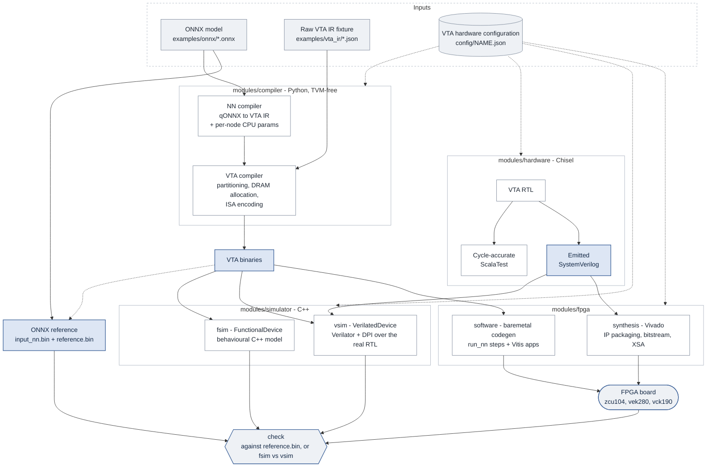

# STANDALONE-VTA

A maintained, unified, and extended Versatile Tensor Accelerator (VTA) ecosystem.

## Overview

This repository addresses the limitations of the original VTA project by providing:

- **Unified Simulation:** A consistent input format (raw binary files) for both functional (C++) and cycle-accurate (CHISEL) simulators.
- **Extended Cycle-Accurate Simulation:** Enriched cycle-accurate simulation with multiple test cases for different submodules.
- **Standalone Compiler:** An open-source, TVM-independent compiler for generating VTA binaries from JSON/ONNX representations.

This project aims to improve VTA's usability and applicability, particularly in safety-critical systems like aeronautics. VTA is an open-source hardware accelerator designed to efficiently execute matrix multiplications, a core operation in Convolutional Neural Networks (CNNs).

## Architecture & System Flow

The `standalone-vta` ecosystem is designed with a clear separation of concerns:
one compiler front-end feeding three interchangeable execution back-ends (a fast
C++ model, the real Chisel RTL, and silicon on an FPGA), all parameterised by a
single hardware configuration file.



1. **Configuration** - `config/<name>.json` is the single source of truth for the
   hardware parameters (block size, buffer depths, data widths, in log2 notation).
   The same file parameterises the compiler, the generated C++ config header, the
   Chisel elaboration and the synthesised bitstream. See
   [config/README.md](config/README.md).
2. **Front-end** - two entry points. A quantised ONNX model goes through
   `nn_compiler`, which emits the VTA IR plus the per-node CPU parameters and
   `dependency.csv`. A hand-written VTA IR fixture (`examples/vta_ir/`) is already
   IR and skips that stage, so it has no golden output.
3. **Compiler** - `vta_compiler` applies the configuration: it pads and partitions
   the matrices into `block_size x block_size` tiles, allocates DRAM addresses and
   encodes the 128-bit VTA instructions and 32-bit micro-ops. Its output is the
   set of `.bin` streams and address/metadata CSVs that every back-end consumes.
4. **Reference** - for ONNX models, a separate task runs the model with ONNX
   Runtime to produce `input_nn.bin` (the randomly generated network input) and
   `reference.bin` (the golden output).
5. **Functional simulation** (`modules/simulator`) - `fsim` executes the binaries
   against a behavioural C++ model of VTA. Fast, and the usual first check.
6. **Cycle-accurate simulation** (`modules/hardware` + `modules/simulator`) - the
   Chisel sources are both the actual hardware and the cycle-accurate model. They
   run directly under ScalaTest, and they are emitted as SystemVerilog that
   `vsim` drives through Verilator and DPI, so `vsim` runs the same binaries as
   `fsim` against the real RTL.
7. **FPGA** (`modules/fpga`) - the same RTL is emitted for the Xilinx IP flow and
   synthesised by Vivado into a bitstream and XSA, while the baremetal codegen
   turns the compiled model into an ARM PS application that copies the binaries
   into DDR and drives VTA through its control registers. The board runs the same
   `.bin` streams as both simulators.

The instruction and micro-op streams are the contract between these components:
the compiler encodes them, the Chisel RTL and the C++ functional model decode
them, and the PS software treats them as opaque bytes. Their bit layout is fixed
by the ISA and must match across all three.

Mill orchestrates the whole flow and caches it per (model, config) and per
(config, board), so switching any axis reuses what the others already produced.
See [MILL.md](MILL.md).

## Repository Map

- `modules/`: Core source code, one directory per module. Each has its own
  `package.mill` and is addressable as a Mill module (`modules.compiler`,
  `modules.simulator`, ...).
  - `compiler/`: Python-based VTA compiler (TVM-independent).
  - `simulator/`: Fast C++ functional simulator (and the Verilated/DPI backend).
  - `hardware/`: Chisel hardware sources - the cycle-accurate simulator, and the SystemVerilog emitted for the Verilated and FPGA flows.
  - `fpga/`: FPGA synthesis flow and the PS-side baremetal runtime software.
- `Makefile`: Root Makefile - the quickstart front end over Mill (see [Quickstart](#3-quickstart)).
- `build.mill`: Root Mill build - the shared config plumbing and the cross keys the pipeline modules are built from. Advanced usage: [MILL.md](MILL.md).
- `modules/pipeline.mill`: The per-(model, config) pipeline traits (compile, simulate, baremetal, Vitis, post-synthesis) that the pipeline modules mix in.
- `config/`: Contains `vta_config.json` defining the VTA hardware parameters, plus alternative configurations. See [Config Documentation](config/README.md).
- `examples/`: Sample inputs and their Mill module (`examples/package.mill`), plus a per-module Makefile predating the Mill build.
  - `onnx/`: Full ONNX models, driven by `examples.onnx[<model>,<config>]`.
  - `vta_ir/`: Hand-written raw VTA IR fixtures, driven by `examples.ir[<fixture>,<config>]`.
- `tutorials/`: Jupyter notebooks detailing the compiler components.
- `out/`: Mill's output tree - each task writes into its own dest directory here.
- `compiler_output/`, `reference_output/`, `simulators_output/`, `log_output/`: Default directories for compiler artifacts, the ONNX reference (`input_nn.bin` + `reference.bin`), simulation results and run logs when driving the flow through the per-module Makefiles rather than Mill (the root Makefile goes through Mill, so its artifacts land in `out/`). The reference is kept out of `compiler_output/` on purpose: `input_nn.bin` is randomly generated, and separating it removes one source of non-reproducibility from `compiler_output/`. `compile` is still not byte-reproducible on its own, though: `nn_compiler` also seeds placeholder accumulator data for MaxPool/Relu/QLinearAdd nodes from an unseeded RNG, straight into `compiler_output/`.

## Documentation Index

Explore the detailed documentation for each component of the `standalone-vta` ecosystem:

- **Root Documentation**
  - [Project Overview & Quickstart](README.md)
  - [Advanced Usage: the Mill build](MILL.md)
  - [Configuration (`vta_config.json`)](config/README.md)

- **Compiler (`modules/compiler/`)**
  - [Standalone VTA Compiler](modules/compiler/vta_compiler/operations_definition/README.md)

- **Simulator (`modules/simulator/`)**
  - [Functional Simulator (C++)](modules/simulator/README.md)
- **Hardware (`modules/hardware/`)**
  - [Hardware (Chisel)](modules/hardware/README.md)
  - [Simulator Test Documentation](modules/hardware/src/test/documentation/test_documentation.md)
  - [Simulator Testbench README](modules/hardware/src/test/scala/simulatorTest/README.md)
  - [Formal Verification README](modules/hardware/src/test/scala/formal/README.md)

- **FPGA (`modules/fpga/`)**
  - [FPGA Implementation & IP Generation](modules/fpga/README.md)
  - [FPGA Runtime Software](modules/fpga/software/README.md)
- **Tutorials**
  - [Tutorials Overview](tutorials/README.md)

## Getting Started

### 1. Prerequisites

Before setting up the environment, ensure you have the following installed on your host machine:

- **Pixi** installed on your host machine ([Installation Guide](https://pixi.prefix.dev/latest/installation/)).
- **Vivado/Vitis 2025.2** installed on your host machine (only required for FPGA synthesis/implementation). Refer to the [Vitis Toolchain Setup Guide](https://toulouse-embedded-accel.github.io/HEAT/quickstarts/vitis-toolchain-setup/) for toolchain installation details.

#### Working Behind a Corporate Proxy

If you are working behind a corporate proxy, make sure to export the proxy settings and JVM options:

```bash
export http_proxy="http://<PROXY_HOST>:<PORT>"
export https_proxy="http://<PROXY_HOST>:<PORT>"
export JAVA_TOOL_OPTIONS="-Dhttp.proxyHost=<PROXY_HOST> -Dhttp.proxyPort=<PORT> -Dhttps.proxyHost=<PROXY_HOST> -Dhttps.proxyPort=<PORT>"
```

### 2. Environment Setup

Clone the repository and activate the Pixi environment:

```bash
# Clone the repository
git clone https://github.com/onera/standalone-vta.git
cd standalone-vta

# Start the environment shell
pixi shell
```

#### Hardware Implementation

If you are using the hardware implementation, you need to source the Vitis 2025.2 settings script and optionally configure your Xilinx license (especially if targeting a Versal board):

```bash
# Source Vitis 2025.2 settings
source /opt/Xilinx/Vitis/2025.2/settings64.sh

# Configure Xilinx License (if required)
export XILINXD_LICENSE_FILE=<port>@<server> # or path/to/license.lic
```

### 3. Quickstart

The root `Makefile` is the entry point: it wraps the Mill build for the common
flow (compile a model, simulate it, synthesize a bitstream, build the baremetal
apps) so a first run needs no knowledge of Mill. Run it from the repository
root, inside the Pixi environment.

```bash
make            # or `make help`: list every target and the current settings
```

| Target            | What it does                                                                            |
| ----------------- | --------------------------------------------------------------------------------------- |
| `make compile`    | Compile the ONNX model to VTA binaries (`nn_compiler` + `vta_compiler`).                |
| `make fsim`       | Run the functional (C++) simulation and check it against the ONNX reference.            |
| `make vsim`       | Run the cycle-accurate (Verilated RTL) simulation and check it the same way.            |
| `make synthesis`  | Run the Vivado synthesis for the target board (bitstream + XSA).                        |
| `make baremetal`  | Create the Vitis workspace with the baremetal applications.                             |
| `make inspect`    | Show every task available for the current model and config, with its description.       |
| `make check_onnx` | Run every model in `examples/onnx/` through the functional simulation, on `vta_config`. |
| `make check_irs`  | Run every raw VTA IR fixture through both simulators and compare them.                  |
| `make tests`      | Run the Chisel, synthesis and baremetal-codegen test suites (slow, ~20 min).            |

Each target compiles whatever it depends on if it is stale, so `make fsim` on a
fresh clone compiles the model first. A typical first run:

```bash
make fsim     # the default model and config, functional simulation
make vsim     # the same model through the Chisel RTL
```

Four variables select what is being built:

| Variable   | Default                            | Meaning                                                                  |
| ---------- | ---------------------------------- | ------------------------------------------------------------------------ |
| `ONNX`     | `examples/onnx/qyolo_pattern.onnx` | The ONNX model to compile and run. Its basename is a cache key.          |
| `CONFIG`   | `vta_config`                       | The hardware configuration, from `config/<CONFIG>.json`.                 |
| `BOARD`    | `zcu104`                           | The FPGA board, from `modules/fpga/boards/<BOARD>.json`.                 |
| `DDR_BASE` | `0x100000`                         | DDR base address baked into the baremetal codegen. Must match the board. |

```bash
make CONFIG=vta_w8b fsim
make ONNX=examples/onnx/qyolo.onnx CONFIG=vta_w8b vsim
make BOARD=vek280 CONFIG=vta_w8b synthesis
```

`make baremetal` additionally takes `RUNNER` (default `run_nn run_nn_uart`) and
`DATA_LOADER` (default `elf sd`), which choose the baremetal applications and
how the model data reaches DDR:

```bash
make RUNNER=run_nn DATA_LOADER=tcl baremetal
```

The available values are read from the filesystem: any `.onnx` under
`examples/onnx/` (or anywhere else - `ONNX` takes any path), any
`config/*.json`, any `modules/fpga/boards/*.json`.

Artifacts are cached per (model, config) and per (config, board), so switching
`ONNX`, `CONFIG` or `BOARD` does not rebuild what the others already produced:
each model keeps its own directory under `out/run/<model>/<config>/`. Only one
model is addressable at a time, though - the one `ONNX` names - so building a
set of models in one command needs the Mill entry points described in
[MILL.md](MILL.md). Switching `ONNX`, `CONFIG` or `BOARD` between two `make` runs
needs no cleaning or restart: switching back finds the earlier results cached.

To drop the cached artifacts:

```bash
make clean          # the current (model, config) run artifacts only
make cleaner        # every model's, every config's (the whole out/run tree)
make clean-target   # this (config, board) FPGA cache
```

### 4. Going further

The Makefile covers one model through the default pipeline. Everything else -
running several models or configs side by side, the raw VTA IR fixtures, the
individual FPGA and Vitis tasks, the on-board isolation runners, the
post-synthesis gate-level check, the Chisel test suites, and how the build
caches all of it - is driven directly with `./mill` and documented in
[MILL.md](MILL.md).
