# Operations Definition Tools

This directory contains information and tools for defining and generating VTA instructions.

## Overview

This directory contains:
* `structures_insn_uop.py`: the definition of the instructions and UOP format. 
* The instruction example files.

## Operation Format

The operations are composed of:
* A 128-bit instruction that specify the operation to perform
* A 32-bit to point the data to use during a computation

The following schematic illustrates the difference between the UOP and the instructions.

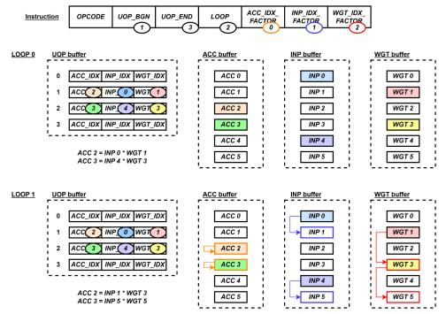

VTA's Instruction Set Architecture (ISA) is composed of 4 CISC (Complex Instruction Set Computer) with variable latency:
* LOAD
* GEMM
* ALU
* STORE

| OPCODE | Value      |
|:------:|:----------:|
| LOAD   | 0 / 0b 000 |
| STORE  | 1 / 0b 001 |
| GEMM   | 2 / 0b 010 |
| FINISH | 3 / 0b 011 |
| ALU    | 4 / 0b 100 |

The VTA architecture is composed of 4 modules:
* Fetch: loads instruction streams from DRAM and decodes them to dispatch them into the corresponding command queues
* Load: loads 2D input and weight tensors from DRAM into on-chip memories (buffers)
* Compute: 
    * performs dense linear algebra computation (GEMM) or general computation (ALU)
    * loads data (bias) from DRAM into register file and loads UOP kernels into UOP cache
* Store: stores 2D output tensors produced by compute module into DRAM

The default pipeline is a 3-stage pipeline: Load-Compute-Store. It can be modified depending on the needs, for example: Load-Gemm-Activation-Store.

### <u>**Fetch Module**</u>

Fetch module is the entry point of VTA to the CPU, it is programmed via three memory mapped registers:
* `control` (read-write): starts Fetch module and is read to check for its completion
* `insn_count` (write-only): sets the number of instructions to execute **(Is it READ-ONLY?)**
* `insns` (write-only): sets the start address of the instruction stream in DRAM **(Is it READ-ONLY?)**

The steps are:
1. CPU prepares the instruction stream in DRAM (physically-contiguous buffer prepared by the VTA runtime)
2. CPU writes the start physical address into `insns`, the length of the intruction stream into `insn_count`
3. CPU asserts the start signal in `control` => starts VTA
4. VTA reads the instruction stream from DRAM via DMA
5. Fetch module partially decodes instructions (OPCODE + BUFFER_ID)
    * LOAD + UOP or Register file => Compute module
    * LOAD + INP or WGT => Load module
    * STORE => Store module
    * GEMM => Compute module
    * ALU => Compute module

**RQ:**
If the command queues are full, Fetch module stalls until the queue are not full.

### <u>**Instruction LOAD and STORE**</u>

The LOAD and STORE modules copy 2D tensors between:
* Global DRAM
* Local DRAM:
    * Input buffer
    * Weight buffer
    * Output buffer
    * Register file / accumulator buffer
    * UOP cache

| Memory type | Value      |
|:-----------:|:----------:|
| UOP cache   | 0 / 0b 000 |
| WGT buffer  | 1 / 0b 001 |
| INP buffer  | 2 / 0b 010 |
| ACC buffer  | 3 / 0b 011 |
| OUT buffer  | 4 / 0b 100 |
| ACC 8-bit   | 5 / 0b 101 |

First 64-bit subfield:
* OPCODE (3-bit): the macro operation to perform (to dispatch)
* DEPT_FLAGS (4-bit): dependency queues (pop or push a flag)
* BUFFER_ID / SRAM_MEM (3-bit): the buffer to load or store the data (UOP, WEIGHT, INPUT, ACCUMULATOR)
* SRAM_BASE (16-bit): local SRAM address (considering the selected buffer)
* DRAM_BASE (32-bit): global DRAM address (host)
* unused (6-bit)

Second 64-bit subfield:
* Y_SIZE (16-bit): number of DRAM memory row to copy
* X_SIZE (16-bit): number of DRAM memroy column to copy
* X_STRIDE (16-bit): DRAM memory shift in a row before the next data
* Y_PAD_TOP (4-bit): number of memory row add on top to the copied data
* Y_PAD_BOTTOM (4-bit): number of memory row add on bottom to the copied data
* X_PAD_LEFT (4-bit): number of memory column add on left to the copied data
* X_PAD_RIGHT (4-bit): number of memory column add on right to the copied data
* unused (0-bit)

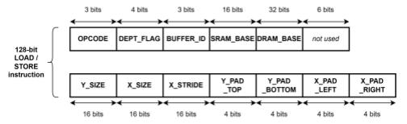

LOAD pseudo-code:
```
for i in range (0, Y_SIZE + Y_PAD_TOP + Y_PAD_BOTTOM):
    for j in range (0, X_SIZE + X_PAD_LEFT + X_PAD_RIGHT):
        sram_loc = SRAM_BASE + i * (X_SIZE + X_PAD_LEFT + X_PAD_RIGHT) + j
        dram_loc = DRAM_BASE + (i - X_PAD_LEFT) * X_STRIDE + (j - Y_PAD_TOP)
        if (i < Y_PAD_TOP  || i >= Y_SIZE + Y_PAD_TOP || 
            j < X_PAD_LEFT || j >= X_SIZE + X_PAD_LEFT):
            mem[sram_loc] = 0
        else:
            mem[sram_loc] = dram_loc
```

**RQ:**
The bitwidths correspond to the default configuration.

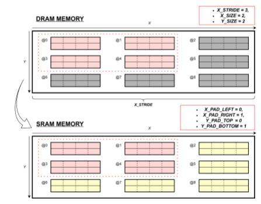

### <u>**Instruction GEMM and ALU**</u>

Compute module acts as a RISC (Reduced Instruction Set Computer) processor that performs computation on tensor registers rather than scalar registers. Compute module performs RISC Micro-Operations (UOP) from the UOP cache. It can compute two type of UOP:
* GEMM operation 
* Tensor operation

Compute module is composed of two computational cores:
* GEMM core: dense linear algebra computation
* Tensor ALU: general computation (common activation, normalisation and pooling operations)
=> UOP only specifies data access patterns

**RQ:**
Tensor ALU executes at a rate of at most 1 operation every two cycles (one register file tensor can be read per cycle).

**RQ:** 
To balance the resource utilisation footprint of Tensor ALU with GEMM core: tensor-tensor operation is by default performed via vector-vector operations over multiple cycles (tensor-tensor operation at once is expensive due to wide register files (32-bit integers)).

The first 64-bit subfield is common to GEMM and ALU:
* OPCODE (3-bit): the macro operation to perform (to dispatch)
* DEPT_FLAGS (4-bit): dependency queues (pop or push a flag)
* RESET (1-bit): if raised: resets the computational cores (dump buffers and register file)
* UOP_BEGIN / UOP_BGN (13-bit): UOP cache start position
* UOP_END (14-bit): UOP cache end position (exclusive)
* LOOP_OUT (14-bit): number of outer loop
* LOOP_IN (14-bit): number of inner loop
* unused (1-bit)

The second 64-bit subfield is different depending on GEMM or ALU.

#### <u>**GEMM**</u>

Second 64-bit subfield:
* ACC_IDX_FACTOR_IN / X0 (11-bit): incrementation on the accumulator index at each inner loop
* ACC_IDX_FACTOR_OUT / X1 (11-bit): incrementation on the accumulator index at each outer loop
* INP_IDX_FACTOR_IN / Y0 (11-bit)
* INP_IDX_FACTOR_OUT / Y1 (11-bit)
* WGT_IDX_FACTOR_IN / Z0 (10-bit)
* WGT_IDX_FACTOR_OUT / Z1 (10-bit)
* unused (0-bit)

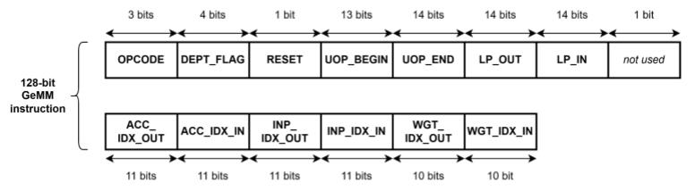

Micro-Operations (UOP) 32-bit field:
* ACC_IDX / X (11-bit): base index for the accumulator
* INP_IDX / Y (11-bit): base index for the input
* WGT_IDX / Z (10-bit): base index for the weight
* unused (0-bit)

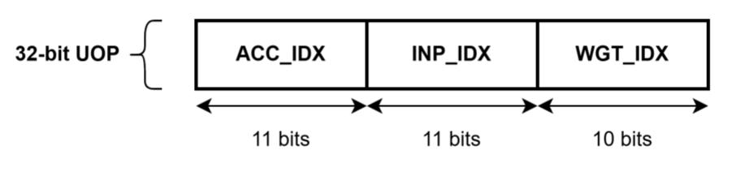

GEMM pseudo-code:
```
for i0 in range (0, END0):
    for i1 in range (0, END1):
        for uop_idx in range (UOP_BEGIN, UOP_END):
            X, Y, Z = decode_gemm_indices(uop_buffer[uop_idx])
            reg_idx = i0 * X0 + i1 * X1 + X
            inp_idx = i0 * Y0 + i1 * Y1 + Y
            wgt_idx = i0 * Z0 + i1 * Z1 + Z
            reg_file[reg_idx] += GEMM(inp_buff[inp_idx], wgt_buff[wgt_idx])
```

#### <u>**ALU**</u>

Second 64-bit subfield:
* DST_IDX_FACTOR_IN / X0 (11-bit)
* DST_IDX_FACTOR_OUT / X1 (11-bit)
* SRC_IDX_FACTOR_IN / Y0 (11-bit)
* SRC_IDX_FACTOR_OUT / Y1 (11-bit)
* ALU_OPCODE / OP (3-bit): sets the operation to perform
* USE_IMM (1-bit): if raised: tensor-scalar operations 
* IMMEDIATE / IMM (16-bit): scalar operator
* unused (0-bit)

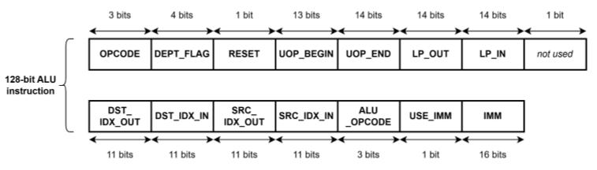

Micro-Operations (UOP) 32-bit field:
* DST_IDX / X (11-bit)
* SRC_IDX / Y (11-bit)
* unused (10-bit)

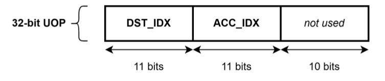

Tensor ALU Micro-Operations:

| ALU OPCODE | Semantics                        | ALU OPCODE Value | USE_IMM |
|:----------:|:--------------------------------:|:----------------:|:-------:|
| MIN(x, y)  | R[x] = R[x] < R[y] ? R[x] : R[y] | 0 / 0b 000       | 0       |
| MAX(x, y)  | R[x] = R[x] > R[y] ? R[x] : R[y] | 1 / 0b 001       | 0       |
| ADDI(x, C) | R[x] = R[x] + C                  | 2 / 0b 010       | 1       |
| ADD(x, y)  | R[x] = R[x] + R[y]               | 2 / 0b 010       | 0       |
| SHRI(x, C) | R[x] = R[x] >> C                 | 3 / 0b 011       | 1       |
| MULI(x, C) | R[x] = R[x].lo * C               | 4 / 0b 100       | 1       |
| MUL(x, y)  | R[x] = R[x].lo * R[y].lo         | 4 / 0b 100       | 0       |

**RQ:**
C is the "IMMEDIATE" value

ALU pseudo-code:
```
for i0 in range (0, END0):
    for i1 in range (0, END1): 
        for uop_idx in range (UOP_BEGIN, UOP_END):
            X, Y = decode alu_indices(uop_buffer[uop_idx])
            dst_idx = i0 * X0 + i1 * X1 + X
            src_idx = i0 * Y0 + i1 * Y1 + Y
            if USE_IMM:
                reg_file[dst_idx] = OP(reg_file[dst_idx], IMM)
            else:
                reg_file[dst_idx] = OP(reg_file[dst_idx], reg_file[src_idx])
```

## General remarks

The execution is generally as follow:

0. Reset instructions: the compute cleans its internal buffer ACC before using it in the following step.
1. Operation instructions: the "operational" instructions to load, compute and store the data.
2. Clean and finish instructions: the remaining semaphore are dumped through empty instructions and the execution is terminated by a finish.

## Example: `insn_matrix_16x16.py`

Execute the code with: `python insn_matrix_16x16.py`.

The instructions enable the multiplication of a matrix 16x16 elements, A, with another 16x16 matrix, B.

As the input is a set of vectors, the matrix A is divided in 16 vectors. Each vector of the matrix A will be multiplied with the matrix B and will result in a new output vector.

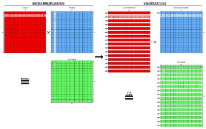

A single GeMM instruction is necessary to perform this multiplication (in addition to the Load and Store).

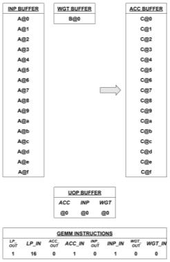


## Example: `insn_average_pooling.py`

Execute the code with: `python insn_average_pooling.py`.

The instructions enable an average pooling operation usually after a GeMM operation. 
In the example, we consider a 4x4 tensor with two channels on which a average pooling of 2x2 with a stride of 2 is applied. It results then in a 4x4 tensor with 2 channels.

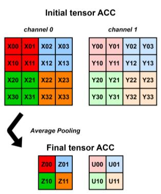

The tensor are converted into matrix as following:
* Each column of the matrix is a tensor channel.
* The elements of each column correspond to the flattenn channel.
* As VTA uses 16-element vector, columns filled with 0 are added.

To perform the average pooling operation, first, the element on each vector must be add together two by two, then, it must be divided by 4 to obtain the mean. As the VTA works with integer, the division round down the value (e.g., 3.5 becomes 3 and -3.5 becomes -4). To do so, the TensorAlu is used.

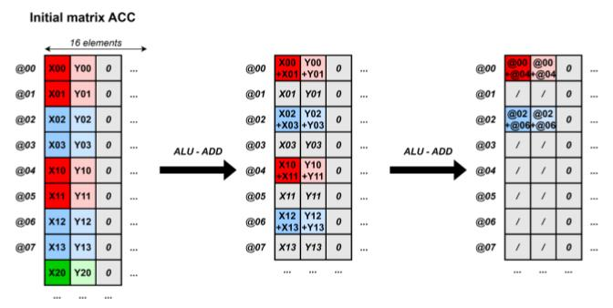

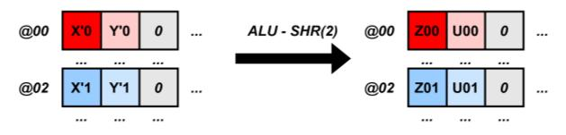

It results in 3 ALU instructions: 2 adds and 1 shift right to divide.

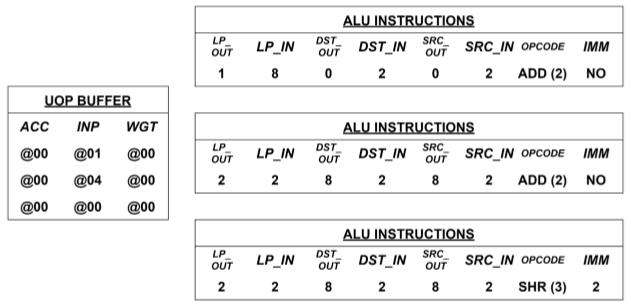


## Example: `insn_lenet5_conv1_relu_average_pooling.py`

Execute the code with: `python insn_lenet5_conv1_relu_average_pooling.py`.

This example consists of executing the first part of the LeNet-5 network.

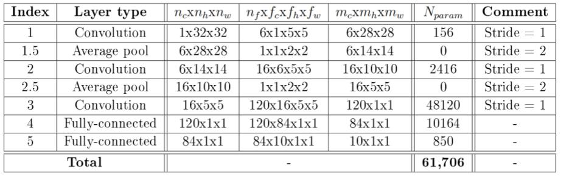

LeNet-5 first convolution is performed with a matrix multiplication where A is 784x25 elements and B is 25x6. The matrix are padded to be 784x32 elements and 32x16 elements.

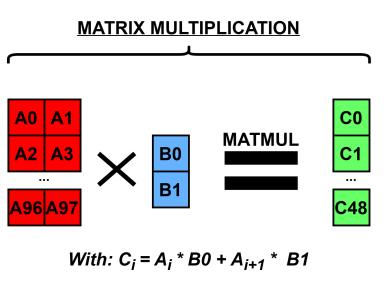

This massive multiplication can be executed with a single GeMM instructions.

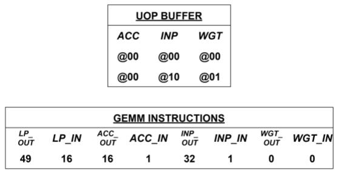

The instruction is followed by a ReLU activation, it means each negative value is grounded to 0 thank to an element wise maximum operator with 0.

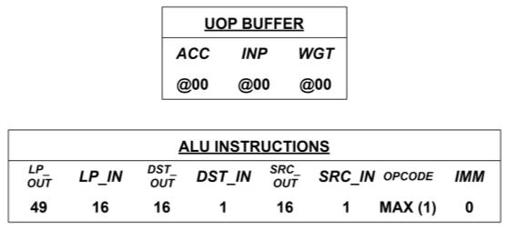


Finally, an average pooling is applied with 2 ADD and 1 shift right.

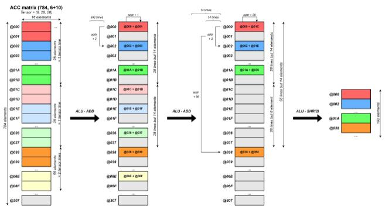

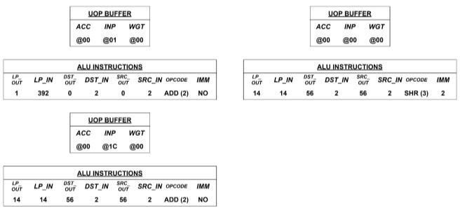

