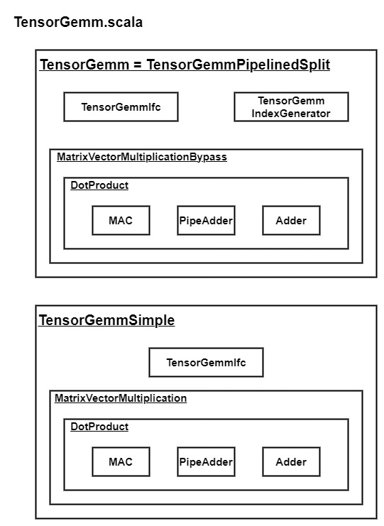

# <u>**CHISEL test explanation**</u>

## <u>**CHISEL overview**</u>

The CHISEL architecture is as follow:
* Core: the VTA architecture including all the modules
    * Fetch: to decode the instructions and send it to the other module
    * Load: including TensorLoad (to load multiple vectors)
    * Store: including TensorStore (to store multiples vectors)
    * Compute: the module of interest (detailed later)

Core is instantiated by VTAShell (src/main/scala/shell/VTAShell.scala). It can be used through an AXI protocol. An example on how to use it may be found there: https://github.com/apache/tvm-vta/tree/main/apps (tsim_example and gemm folders).

## <u>**Compute module**</u>

Compute is the module of interest. 
Its IO ports are:
* `i_post` (in): the input dependency queues (Can Compute read the input/weight buffers? Can Compute write on the output buffer?)
* `o_post` (out): the output dependency queues (Have Compute read the input/weight buffers? Have Compute write on the output buffer?)
* `inst`: the instructions coming from Fetch
* `uop_baddr` (in): the DRAM base address of the UOP (Compute load itself the UOP from DRAM to UOP buffer)
* `acc_baddr` (in): the DRAM base address of the accumulator vectors (Compute load itself the accumulator vectors from DRAM to accumulator register)
* `vme_rd`: ??? (probably Virtual Memory)
* `inp`: the input tensor coming from Load (input buffer)
* `wgt`: the weight tensor coming from Load (weight buffer)
* `out`: the output tensor given to Store (output buffer)
* `finish` (out): a boolean to ??? (probably to indicate the end of the operations)
* `acc_wr_event` (out): a boolean to ??? (probably to indicate that the accumulator register has been updated)

Compute is composed of multiple submodules:
* ComputeDecode: fetch the instruction within the Compute module
* SyncQueue: the instruction queues (dispatch instructions to submodules)
* LoadUopTop: to load the UOP from DRAM to UOP buffer
* TensorLoad: to load the accumulator vectors from DRAM to accumulator register
* GemmDecode: interface the instructions with TensorGemm
* TensorGemm: perform GeMM (matrix-vector) operations
* AluDecode: interface the instructions with TensorAlu
* TensorAlu: perform ALU (min, max, add, shift) operations
* Semaphore: the dependency queues (avoid conflict on shared resource between Compute, Load and Store modules)

### <u>**TensorGemm submodule**</u>

Two architecture are proposed for TensorGemm submodule:
* TensorGemmPipelinedSplit: the real architecture (it is the one called when TensorGemm is called)
* TensorGemmSimple: a simplified architecture that abstracts the memory

TensorGemm submule's IO ports are:
* `start` (in): a boolean to start the GeMM operations
* `done` (out): a boolean to indicate that the operation is done
* `dec` (in): the decoded instruction from GemmDecode
* `uop`: the uop buffer from LoadUopTop
* `inp`: the input buffer from Load module
* `wgt`: the weight buffer from Load module
* `acc`: the accumulator register from TensorLoad
* `out`: the output buffer to Store module
* `state` (out): the current state within the finite machine state (for debug purpose?)
* `inflight` (out): ??? (output signal, for debug purpose?)

The list of the elements within the architecture:
* TensorGemmIfc: the interface managing the IO of the submodule
* TensorGemmIndexGenerator: manage the memory interaction (only for TensorGemmPipelinedSplit)
* MatrixVectorMultiplicationBypass: interface DotProduct with the memory (only for TensorGemmPipelinedSplit)
* MatrixVectorMultiplication: abstract the memory to use DotProduct (only TensorGemmSimple)
* DotProduct: pipeline the MAC and PipeAdder or Adder
* MAC: pipelined multiply-accumulate unit
* PipeAdder: combinational logic adder that loads input into registers and before computing and firing the output at the next cycle
* Adder: combinational logic adder that directly computes and fires the output (does not wait the next cycle)

### <u>**TensorAlu submodule**</u>

Two architecture are proposed for TensorAlu submodule:
* TensorAluPipelined: the real architecture (it is the one called when TensorAlu is called)
* TensorAluOrig: a simpler version of the architecture (seems to be deprecated)

TensorAlu submule's IO ports are:
* `start` (in): a boolean to start the Alu operations
* `done` (out): a boolean to indicate that the operation is done
* `dec` (in): the decoded instruction from AluDecode
* `uop`: the UOP buffer from LoadUopTop
* `acc`: the accumulator register from LoadTensor
* `out`: the output buffer to Store module

The list of the elements within the architecture:
* TensorAluIfc: the interface managing the IO of the submodule
* TensorAluIndexGenerator: manage the memory interaction
* AluVector: "vector of pipelined Alu"
* AluReg: "pipelined Alu"
* Alu: "Alu datapath"

### <u>**Dataflow within Compute**</u>

The dataflow within Compute is the following.

## <u>**Examples**</u>

All the examples are launched with _Launcher.scala_, the _unittest_ are the tests provided with the CHISEL description and the _experiments_ are the added (or modified) tests.
The test can be executed with the following command: `unittest.launcher <test_name>` where _test_\_name_ is the name of the test in the _Launcher.scala_.

<u>Provided tests (unittest):</u>

| Test name | File name | Tested element  | Comment | Status |
|:---------:|:---------:|:---------------:|:-------:|:------:|
| AluVectorTester | AluTest.scala | AluVector (TensorAlu submodule) | Test all the opcode with random vectors (assessed with a reference function) | Passed |
| _DotProductTester_ | GemmTest.scala | DotProduct (TensorGemm submodule) | Perfom a simple test (hardcoded value) | - |
| _AdderTester_ | GemmTest.scala | Adder (TensorGemm submodule) | Perfom a simple test (hardcoded value) | - |
| _PipeAdderTester_ | GemmTest.scala | PipeAdder (TensorGemm submodule) | Perfom a simple test (hardcoded value) | - |
| _MACTester_ | GemmTest.scala | MAC (TensorGemm submodule) | Perfom a simple test (hardcoded value) | - |
| TestMatrixVectorMultiplication | MvmTest.scala | MatrixVectorMultiplication (TensorGemm submodule) | Test matrix-vectors multiplication with random values (assessed with a reference function) | Passed |
| - | SyncQueue2PortMemTest.scala | - | - | - |
| - | SyncQueueTest.scala | - | - | - |
| _TensorAluIndexGeneratorTester_ | TensorAluTest.scala | TensorAluIndexGenerator (TensorAlu submodule) | ? | - |
| TensorAluPipelinedTester | TensorAluTest.scala | TensorAlu (TensorAlu submodule) | Test vectors with an immediate value (no result verification) | Passed |
| TensorGemmJsonTester | TensorGemmJsonTest.scala | TensorGemmPipelinedSplit (TensorGemm submodule) | Test executing JSON (expected value are given in JSON file) | Depend on JSON file |
| _TensorGemmTester_ | TensorGemmTest.scala | TensorGemmSimple (TensorGemm submodule) | Test operation process (no result verification?) | - |
| _TensorGemmIdxTester_ | TensorGemmTest.scala | TensorGemmSimple (TensorGemm submodule) | Test index reading process (no result verification?) | - |
| _TensorGemmIndexGeneratorTester_ | TensorGemmTest.scala | TensorGemmIndexGenerator (TensorGemm submodule) | Test index generation process (no result verification?) | - |
| _TensorGemmPipelinedTester_ | TensorGemmTest.scala | TensorGemmPipelinedSplit (TensorGemm submodule) | Test operation process (no result verification?) | - |
| _TensorGemmResetTester_ | TensorGemmTest.scala | TensorGemm (TensorGemm submodule) | Test reset process (no result verification?) | - |

<u>Our tests (experiments):</u>

| Test name | File name | Tested element | Comment | Status |
|:---------:|:---------:|:--------------:|:-------:|:------:|
| MVM_simple_matrix_multiply | MVM_simple_matrix_multiply.scala | MatrixVectorMultiplication (TensorGemm submodule) | Hard implementation of a matrix-vector multiplication (assessed with a reference function) | Passed |
| AluVectorTest_Max | AluVectorTest_Max.scala | AluVector (TensorAlu submodule) | Handling vector-vector ALU test (reference from AluVectorTester) | Passed |
| TensorAluJsonTester | TensorAluJsonTest.scala | TensorAluPipelined (TensorAlu submodule) | Test executing JSON (expected value are given in JSON file) | Depend on JSON file |

<u>RQ:</u> 
We want to use JSON file to implement our tests. The JSON files can be found in _resources_.

### <u>**GEMM JSON examples**</u>

#### <u>**Preliminary information**</u>

The GeMM is performed with:
* A: the input vector
* B: the weight matrix
* C: the output vector (C = A*B)

The dimension are: X(b, c, h, w)
* b: number of batches
* c: number of channels
* h: number of rows (env.BATCH)
* w: number of colums (env.BLOCK)

The GeMM instruction field:
* RESET: reset flag (1 = reset)
* UOP_BEGIN: index of the first UOP to read
* UOP_END: index+1 of the last UOP to read
* LP\_0 & LP\_1: number of time the GeMM shall be executed
* ACC\_0 & ACC\_1: incrementation of the accumulator index at each execution
* INP\_0 & INP\_1: incrementation of the input index at each execution
* WGT\_0 & WGT\_1: incrementation of the weight index at each execution

The GEMM UOP fields are defined in this order:
1. ACC index
2. INP index
3. WGT index

<u>RQ:</u>
It is still not clear the difference between x\_0 and x\_1. 
It may be used for handling matrix (line and column).
The only one used are x\_0 and the x\_1 = 0, excepted LP\_1 = 1.

#### <u>**GEMM JSON test table**</u>

All the GEMM JSON files are in _test/resources/examples\_gemm_. They are tested using the test: _test/scala/unittest/TensorGemmJsonTest.scala_.

| Test name | JSON file name | Launcher name | Comment | Status |
|:---------:|:--------------:|:-------------:|:-------:|:------:|
| Simple Matrix Multiply | b1_c1h1w16_c1h1w16_simple_matrix_multiply.json | json_gemm_simple_matrix_multiply | - | Passed |
| Output channel | b1_c1h1w16_c2h1w16_output_channel.json | json_gemm_output_channel | - | Passed |
| Rows | b1_c1h2w16_c1h2w16_rows.json | json_gemm_rows | Need to modify the configuration to have multiple rows on VTA |  Failed  |
| Input channel | b1_c2h1w16_c1h1w16_input_channel.json | json_gemm_input_channel | - | Passed |
| Full | b1_c16h1w16_c16h1w16_full.json | json_gemm_full | - | Passed |
| Batches | b2_c1h1w16_c1h1w16_batches.json | json_gemm_batches | - | Passed |

<u>RQ:</u>
The JSON file include the expected result (acc_o). The test compares the computed result with the expected one.

#### <u>**GEMM JSON details**</u>

<u>Simple Matrix Multiply:</u> A(1, 1, 1, 16) ; C(1, 1, 1, 16) 

Instructions: 1 GEMM (= 1 UOP)
* Total with Python API: 10 = 2 reset + 3 LOAD + 1 GEMM + 1 STORE + 3 finish

GEMM field:
* LP = 1
* ACC = 0
* INP = 0
* WGT = 0

<u>Output channel:</u> A(1, 1, 1, 16) ; C(1, 2, 1, 16) 

Instructions: 1 GEMM (= 1 UOP)
* Total with Python API: 10 = 2 reset + 3 LOAD + 1 GEMM + 1 STORE + 3 finish

GEMM field: 
* LP = 2
* ACC = 1
* INP = 0
* WGT = 1

<u>Rows:</u> A(1, 1, 2, 16) ; C(1, 1, 2, 16) 

Instructions: 1 GEMM (= 1 UOP)
* Total with Python API: 10 = 2 reset + 3 LOAD + 1 GEMM + 1 STORE + 3 finish

GEMM field:
* LP = 1
* ACC = 0
* INP = 0
* WGT = 0

 <u>RQ:</u> It does not work: need to modify the configuration (env.BATCH). 

<u>Input channel:</u> A(1, 2, 1, 16) ; C(1, 1, 1, 16) 

Instructions: 2 GEMM (= 2 UOP)
* Total with Python API: 14 = 2 reset + 5 LOAD + 2 GEMM + 1 STORE + 4 finish

GEMM field:
* LP = 1
* ACC = 0
* INP = 0
* WGT = 0

<u>Full:</u> A(1, 16, 1, 16) ; C(1, 16, 1, 16) 

Instructions: 16 GEMM (= 16 UOP)
* Total with Python API: 56 = 2 reset + 33 LOAD + 16 GEMM + 1 STORE + 4 finish

GEMM field: 
* LP = 16
* ACC = 1
* INP = 0
* WGT = 1

<u>Batches:</u> A(2, 1, 1, 16) ; C(2, 1, 1, 16)

Instructions: 1 GEMM (= 1 UOP)
* Total with Python API: 10 = 2 reset + 3 LOAD + 1 GEMM + 1 STORE + 3 finish

GEMM field: 
* LP = 2
* ACC = 1
* INP = 1
* WGT = 0

### <u>**ALU JSON examples**</u>

#### <u>**Preliminary information**</u>

The ALU is performed with:
* X: the source vector
* Y: the loaded destination vector (if USE_IMM = 0)
* IMM: the immediate value (if USE_IMM = 1)
* Z: the output destination vector

The GeMM instruction field:
* RESET: reset flag (1 = reset)
* UOP_BEGIN: index of the first UOP to read
* UOP_END: index+1 of the last UOP to read
* LP\_0 & LP\_1: number of time the GeMM shall be executed
* DST\_0 & DST\_1: incrementation of the destination index at each execution
* SRC\_0 & SRC\_1: incrementation of the source index at each execution
* ALU_OP: the alu opcode
* USE_IMM: use immediate value flag (1 = use it)
* IMM: the immediate value

The ALU UOP fields are defined in this order:
1. DST index
2. SRC index

The ALU opcode:
* 0: MIN
* 1: MAX
* 2: ADD
* 3: Shift Right
* 4: Shift Left

<u>RQ:</u>
It is still not clear the difference between x\_0 and x\_1. 
It may be used for handling matrix (line and column).
The only one used are x\_0 and the x\_1 = 0, excepted LP\_1 = 1.

#### <u>**ALU JSON test table**</u>

All the alu JSON files are in _test/resources/examples\_alu_. They are tested using the test: _test/scala/experiments/alu/TensorAluJsonTest.scala_.

| Test name | JSON file name | Launcher name | Comment | Status |
|:---------:|:--------------:|:-------------:|:-------:|:------:|
| Min | min.json | json_alu_min | - | Passed |
| Min Immediate | min_imm.json | json_alu_min_imm | - | Passed |
| Max | max.json | json_alu_max | - | Passed |
| Max Immediate | max_imm.json | json_alu_max_imm | - | Passed |
| Add | add.json | json_alu_add | - | Passed |
| Add Immediate | add_imm.json | json_alu_add_imm | - | Passed |
| Shift Right | shift_right.json | json_alu_shift_right | Does SHR without imm be possible? |  ?  |
| Shift Right Immediate | shift_right_imm.json | json_alu_shift_right_imm | To understand |  ?  |
| Shift Left | shift_left.json | json_alu_shift_left | Does SHL without imm be possible? |  ?  |
| Shift Left Immediate | shift_left_imm.json | json_alu_shift_left_imm | To understand |  ?  |
| ReLU | relu_activation.json | json_alu_relu | Max with IMM = 0 | Passed |
| Naive MaxPool | naive_maxpool.json | json_alu_naive_maxpool | Multiple vector-vector max with naive implementation | Passed |

<u>RQ:</u>
The JSON file include the expected result (acc_expect). The test compares the computed result with the expected one.

#### <u>**ALU JSON details**</u>

<u>Min:</u>

Instructions: 1 ALU (= 1 UOP)
* Total with Python API: ?

ALU field: 
* LP = 1
* DST = 0
* SRC = 0
* ALU_OP = 0 (min)
* USE_IMM = 0 (NO)
* IMM = 0

<u>Min Immediate:</u>

Instructions: 1 ALU (= 1 UOP)
* Total with Python API: ?

ALU field: 
* LP = 1
* DST = 0
* SRC = 0
* ALU_OP = 0 (min)
* USE_IMM = 1 (YES)
* IMM = 1

<u>Max:</u>

Instructions: 1 ALU (= 1 UOP)
* Total with Python API: ?

ALU field: 
* LP = 1
* DST = 0
* SRC = 0
* ALU_OP = 1 (max)
* USE_IMM = 0 (NO)
* IMM = 0

<u>Max Immediate:</u>

Instructions: 1 ALU (= 1 UOP)
* Total with Python API: ?

ALU field: 
* LP = 1
* DST = 0
* SRC = 0
* ALU_OP = 1 (max)
* USE_IMM = 1 (YES)
* IMM = 1

<u>Add:</u>

Instructions: 1 ALU (= 1 UOP)
* Total with Python API: ?

ALU field: 
* LP = 1
* DST = 0
* SRC = 0
* ALU_OP = 2 (add)
* USE_IMM = 0 (NO)
* IMM = 0

<u>Add Immediate:</u>

Instructions: 1 ALU (= 1 UOP)
* Total with Python API: ?

ALU field: 
* LP = 1
* DST = 0
* SRC = 0
* ALU_OP = 2 (add)
* USE_IMM = 1 (YES)
* IMM = 1

<u>Shift Right:</u>

Instructions: 1 ALU (= 1 UOP)
* Total with Python API: ?

ALU field: 
* LP = 1
* DST = 0
* SRC = 0
* ALU_OP = 3 (shr)
* USE_IMM = 0 (NO)
* IMM = 0

<u>Shift Right Immediate:</u>

Instructions: 1 ALU (= 1 UOP)
* Total with Python API: ?

ALU field: 
* LP = 1
* DST = 0
* SRC = 0
* ALU_OP = 3 (shr)
* USE_IMM = 1 (YES)
* IMM = 1

<u>Shift Left:</u>

Instructions: 1 ALU (= 1 UOP)
* Total with Python API: ?

ALU field: 
* LP = 1
* DST = 0
* SRC = 0
* ALU_OP = 4 (shl)
* USE_IMM = 0 (NO)
* IMM = 0

<u>Shift Left Immediate:</u>

Instructions: 1 ALU (= 1 UOP)
* Total with Python API: ?

ALU field: 
* LP = 1
* DST = 0
* SRC = 0
* ALU_OP = 4 (shl)
* USE_IMM = 1 (YES)
* IMM = 1

<u>ReLU:</u>

Instructions: 1 ALU (= 1 UOP)
* Total with Python API: ?

ALU field: 
* LP = 1
* DST = 0
* SRC = 0
* ALU_OP = 1 (max)
* USE_IMM = 1 (YES)
* IMM = 0

<u>Naive MaxPool:</u>

Instructions: 1 ALU (= 1 UOP)
* Total with Python API: ?

ALU field: 
* LP = 3
* DST = 0
* SRC = 1
* ALU_OP = 1 (max)
* USE_IMM = 0 (NO)
* IMM = 0

